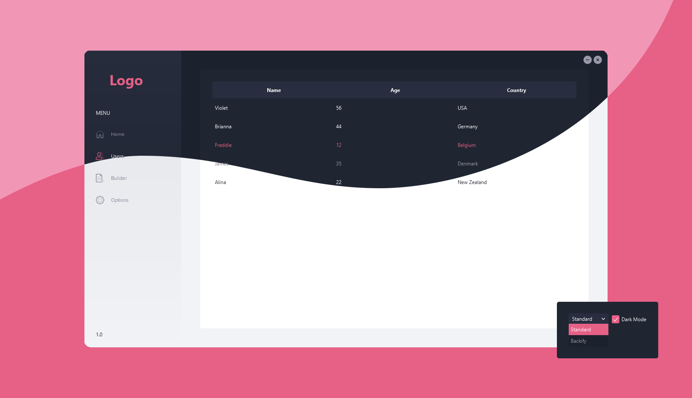
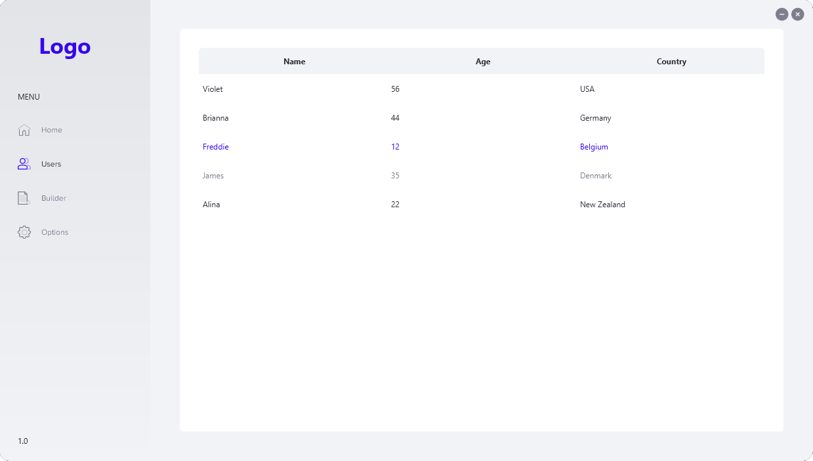
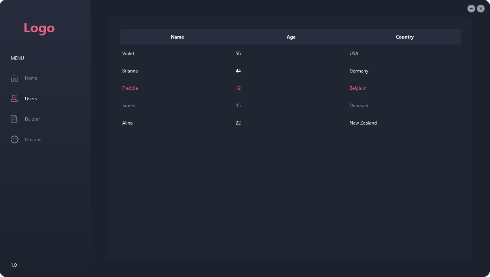
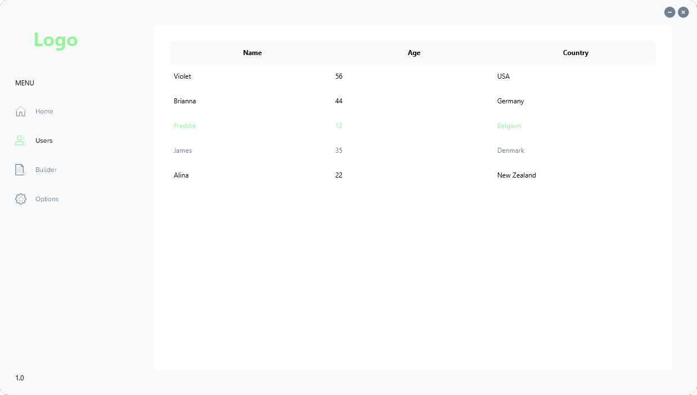
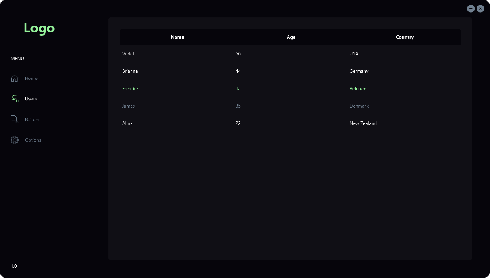
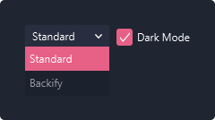

# JavaFX Dashboard

This JavaFX Dashboard is a flexible and versatile template, designed to be used as a starting point for your own custom dashboard projects. It features a theme changer with both dark and light modes, a customizable table builder, and a user-friendly interface.

**[Features](#-features) • [Themes](#-themes) • [Theme Changer](#-theme-changer) • [Table Builder](#-table-builder) • [License](#-license)**



## 💫 Features

- Custom title bar
- Rounded movable window
- Resizeable
- [Theme Changer](#-theme-changer) (with local storage)
- [Table Builder](#-table-builder)

## 🎨 Themes

| Theme    | Light                                                | Dark                                                    |
|----------|------------------------------------------------------|---------------------------------------------------------|
| Standard |  |  |
| Backify  |    |         |
    
## 🌗 Theme Changer



To add a new theme, you need to create a new enumerated value in the [Theme](src/main/java/com/jannikbuscha/dashboard/util/Theme.java) enum:

```java
public enum Theme {

    STANDARD, BACKIFY, /* YOUR_NEW_THEME */;
    // ...
}
```

Then create the corresponding CSS files:

- `dark.css` (Color variables for the dark theme)
- `light.css` (Color variables for the light theme)
- `theme.css` (Semantic color variables and font for the theme)

in the [theme](src/main/resources/com/jannikbuscha/dashboard/css/theme) directory:

```
📦javafx-dashboard
 ┗ 📂src
 ┃ ┗ 📂main
 ┃ ┃ ┣ 📂java
 ┃ ┃ ┗ 📂resources
 ┃ ┃ ┃ ┗ 📂com
 ┃ ┃ ┃ ┃ ┗ 📂jannikbuscha
 ┃ ┃ ┃ ┃ ┃ ┗ 📂dashboard
 ┃ ┃ ┃ ┃ ┃ ┃ ┗ 📂css
 ┃ ┃ ┃ ┃ ┃ ┃ ┃ ┗ 📂theme
 ┃ ┃ ┃ ┃ ┃ ┃ ┃ ┃ ┣ 📂backify
 ┃ ┃ ┃ ┃ ┃ ┃ ┃ ┃ ┣ 📂standard
 ┃ ┃ ┃ ┃ ┃ ┃ ┃ ┃ ┗ 📂your_new_theme
 ┃ ┃ ┃ ┃ ┃ ┃ ┃ ┃ ┃ ┣ 📜dark.css
 ┃ ┃ ┃ ┃ ┃ ┃ ┃ ┃ ┃ ┣ 📜light.css
 ┃ ┃ ┃ ┃ ┃ ┃ ┃ ┃ ┃ ┗ 📜theme.css
 ┗ ...
```

How to structure the content of these files can be found in the [standard theme](src/main/resources/com/jannikbuscha/dashboard/css/theme/standard).

After changing the theme in the dashboard, it is stored locally in `java.io.tmpdir` properties using the [LocalUserData](src/main/java/com/jannikbuscha/dashboard/user/LocalUserData.java) class.

## 🏗️ Table Builder

The table methods in FXUtils simplify the process of building tables and populating the TableView, making it easier to create a well-formatted table of data from the ObservableList.

```java
final ObservableList<User> data = FXCollections.observableArrayList(
        new User("Violet", 56, "USA"),
        new User("Brianna", 44, "Germany"),
        // ...
);

List<TableColumn<User, ?>> columns = Arrays.asList(
        FXUtil.createColumn("Name", User::getName),
        FXUtil.createColumn("Age", User::getAge),
        FXUtil.createColumn("Country", User::getCountry)
);

TableView<User> table = FXUtil.createTable(data, columns);
```

More context can be found for this in the [Options](src/main/java/com/jannikbuscha/dashboard/tab/Options.java)-Tab class.

## 📝 License

[MIT](LICENSE)